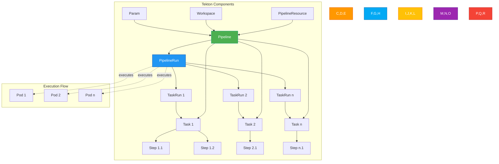

Here's a Mermaid diagram showing the relationship between Tekton Pipeline, PipelineRun, and Task components:

```mermaid
graph TD
    subgraph "Tekton Components"
        A[Pipeline] --> B[PipelineRun]
        A --> C[Task 1]
        A --> D[Task 2]
        A --> E[Task n]
        
        B --> F[TaskRun 1]
        B --> G[TaskRun 2]
        B --> H[TaskRun n]
        
        F --> C
        G --> D
        H --> E
        
        C --> I[Step 1.1]
        C --> J[Step 1.2]
        D --> K[Step 2.1]
        E --> L[Step n.1]
        
        M[PipelineResource] --> A
        N[Workspace] --> A
        O[Param] --> A
    end
    
    subgraph "Execution Flow"
        B -. executes .-> P[Pod 1]
        B -. executes .-> Q[Pod 2]
        B -. executes .-> R[Pod n]
    end
    
    style A fill:#4CAF50,stroke:#009688,color:white
    style B fill:#2196F3,stroke:#0D47A1,color:white
    style C,D,E fill:#FF9800,stroke:#E65100,color:white
    style F,G,H fill:#03A9F4,stroke:#01579B,color:white
    style I,J,K,L fill:#FFC107,stroke:#FF6F00,color:white
    style M,N,O fill:#9C27B0,stroke:#4A148C,color:white
    style P,Q,R fill:#F44336,stroke:#B71C1C,color:white
```

Would you like me to explain the different components shown in this diagram?